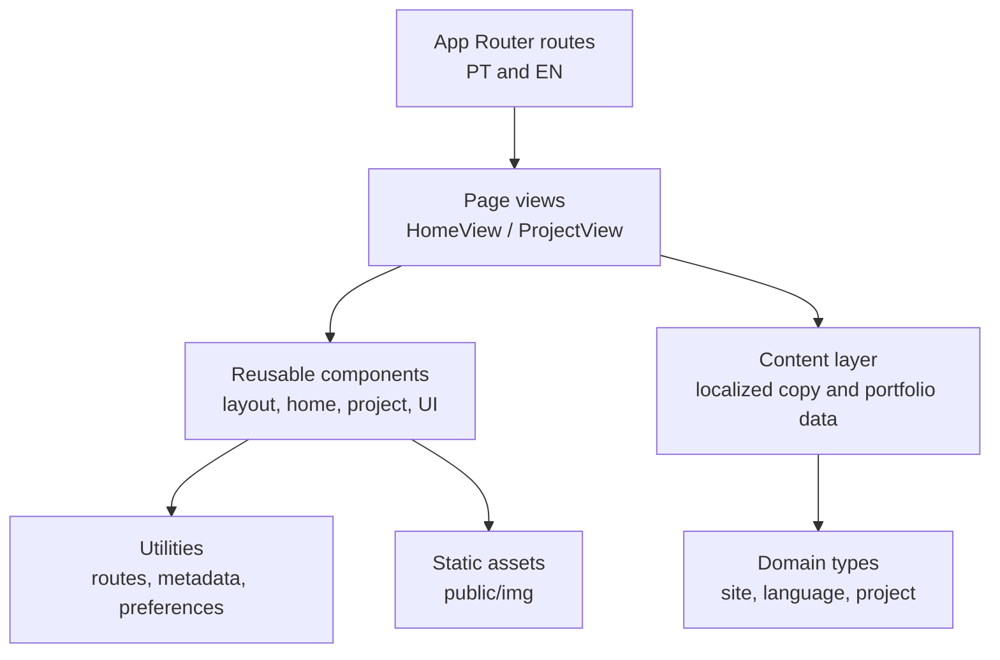

# Matheus Augusto — Portfolio

<p align="center">
  A bilingual portfolio built to present my work, technical perspective, and approach to building software.
</p>

<p align="center">
  
  
  
  
  
</p>

## About

This repository contains the source code for my personal portfolio. It is designed as a focused, bilingual experience where recruiters, collaborators, and developers can quickly understand who I am, how I work, and the kinds of software I build.

I am an **Information Systems student** focused on **.NET/C#**, with experience across backend systems, web interfaces, integrations, and automation. This portfolio is part of the work that represents my academic and professional path.

## Highlights

- **Portuguese and English** routes, with direct language switching.
- **Responsive, dark-first interface** built for clear reading on desktop and mobile.
- **Portfolio case-study layout** with structured sections, technical context, image galleries, and expandable images.
- **Performance-conscious media loading**: off-screen gallery images are lazy-loaded and reserve their layout space before loading.
- **Accessible interaction patterns** with semantic controls, descriptive labels, keyboard-friendly dialogs, and reduced visual friction.
- **Search-ready foundation** with metadata, `robots.txt`, `sitemap.xml`, and Person JSON-LD structured data.
- **Custom 404 page** consistent with the visual language of the site.
- **Static deployment pipeline** prepared for Azure Static Web Apps.

<details>
<summary><strong>Experience design details</strong></summary>

The home page combines an introduction with a navigable About/Projects interface. Project pages use a predictable reading flow, image previews can be expanded without navigating away, and route transitions preserve context when returning to the portfolio.

The interface uses restrained amber accents, subtle motion, and a consistent card system to add depth while keeping the content central.
</details>

## Tech Stack

| Area | Technology | Why it is used |
| --- | --- | --- |
| Framework | Next.js 16, App Router | Static routing, metadata APIs, and an organized page structure. |
| UI | React 19 | Composable interactive components for navigation, galleries, dialogs, and transitions. |
| Language | TypeScript, strict mode | Safer content models and component contracts. |
| Styling | Tailwind CSS 4 | A consistent, maintainable design system expressed close to the components. |
| Typography | `next/font` with Geist | Self-hosted, optimized type loading. |
| Deployment | Azure Static Web Apps | Static hosting with route fallback and response-header configuration. |
| Automation | GitHub Actions | Reproducible validation, build, and deployment workflow. |

## Architecture

The codebase separates routing, presentation, content, and reusable domain types. It is deliberately content-driven: portfolio entries and localized copy live outside the UI components that render them.



```text
src/
├── app/          # Route groups, pages, metadata routes, and global 404 page
├── components/   # Reusable layout, home, project, SEO, and UI components
├── content/      # Localized site copy and portfolio content
├── domain/       # Shared TypeScript models
├── lib/          # Routing, metadata, configuration, and client helpers
└── views/        # Page-level composition
```

## Getting Started

### Prerequisites

- Node.js **20** (defined in [`.nvmrc`](.nvmrc))
- npm

### Run locally

```bash
git clone https://github.com/maat-aug/portfolio
cd portfolio
npm ci
npm run dev
```

Open [http://localhost:3000](http://localhost:3000).

### Validate and build

```bash
npm run typecheck
npm run build
```

The production build exports the static website to `out/`.

To inspect that output locally:

```bash
npm run preview
```

## Deployment

The repository includes a GitHub Actions workflow for Azure Static Web Apps. On pushes to `master`, it:

1. Uses Node.js 20.
2. Installs locked dependencies with `npm ci`.
3. Runs the TypeScript check.
4. Generates the static export.
5. Publishes the `out/` directory.

To enable it, create an Azure Static Web App and add its deployment token to the repository secrets as `AZURE_STATIC_WEB_APPS_API_TOKEN`.

`public/staticwebapp.config.json` defines the static-hosting behavior, including the 404 fallback and security-related response headers.

## Author

- GitHub: [maat-aug](https://github.com/maat-aug)
- Email: [maataug.pessoal@gmail.com](mailto:maataug.pessoal@gmail.com)
